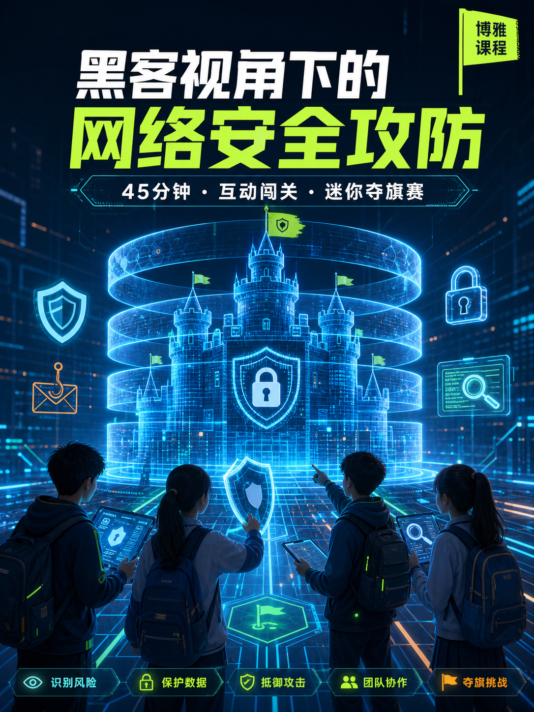

::: {#hero-heading}

世界500强企业中华区信息安全负责人，拥有20年IT与数字化安全经验。

从合规、审计这些"不性感"的小事做起，逐步在组织中建立安全影响力，致力于让安全真正服务于业务发展。

经历了安全行业的完整演变：
- 从政策驱动但技术手段缺失的"摆设期"
- 到有技术手段但无法翻译成业务语言的"孤岛期"
- 到现在，致力于将安全语言翻译成业务语言，让安全真正坐在业务谈判桌上

运营个人公众号 **「安全感制造所」**，专注安全从业者的职业成长与行业洞察。

## Background

- Present: 数智安全负责人，某世界五百强企业
- 20+ years in IT & Security industry
- 企业安全治理｜数字化风险｜AI安全｜安全文化与科普

## 青少年网络安全科普

[《黑客视角下的网络安全攻防》](http://cyberlab.aoutech.uk/)是一堂面向青少年的互动博雅课程。学生通过密码实验、钓鱼识别、纵深防御搭建和迷你夺旗赛，在安全、封闭的模拟环境中学习保护账号、设备与个人信息。

:::
